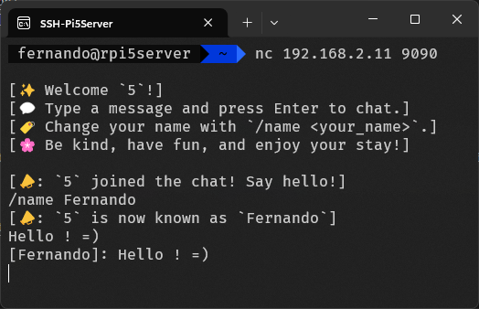

# Simple Chat Server

A lightweight terminal-based chat server.

## Build and Run

```bash
# Uses the default port (9090)
./samples/run.sh chat.cpp

# Uses port 8080
./samples/run.sh chat.cpp 8080
```

## Connect

Using **netcat (`nc`)**:

```bash
nc <server-ip-address> <port>
```

Examples:

```bash
# Local machine
nc localhost 9090

# Remote machine
nc 192.168.1.100 9090
```

## Chat Commands

- Type a message and press **Enter** to send it.
- List all available commands
  ```text
  /help
  ```
- Change your display name with:
  ```text
  /name <your_name>
  ```
- Disconnect form the server
  ```text
  /quit
  ```
- Press **Ctrl+C** or **/quit** to disconnect.

## Screenshot



## Notes

- The default server port is **9090**.
- If clients connect from another machine, ensure the selected port is allowed through the server's firewall.